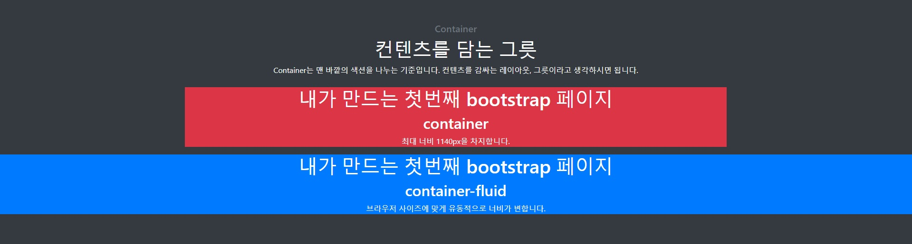
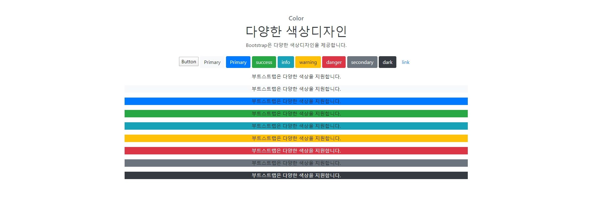
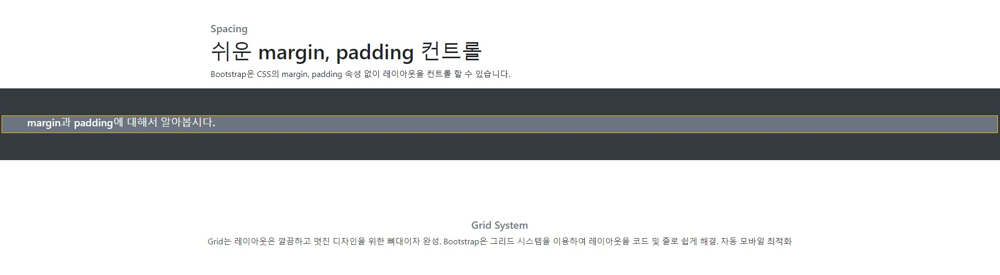
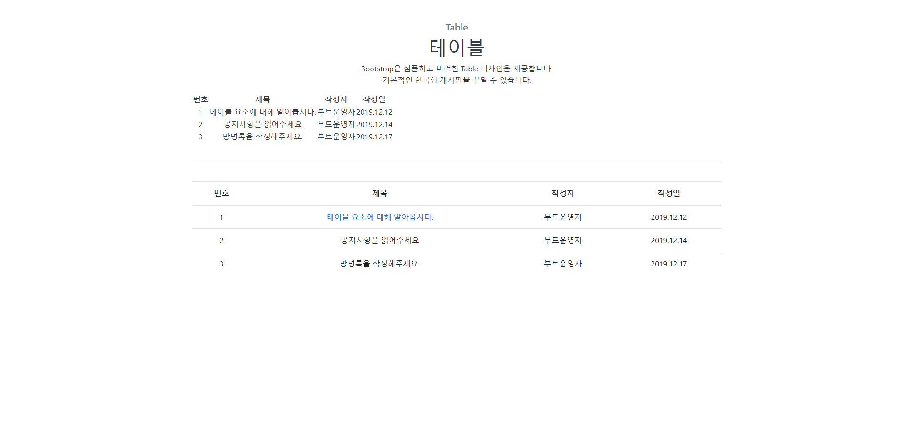
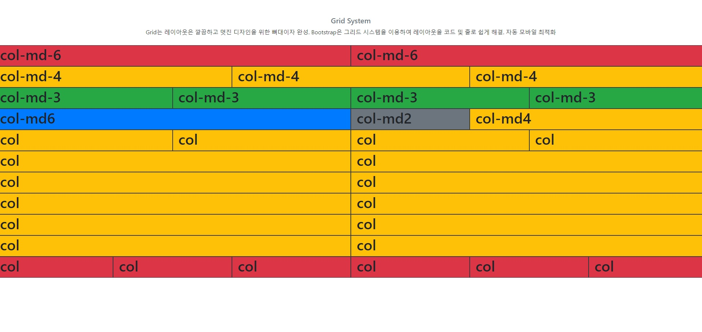
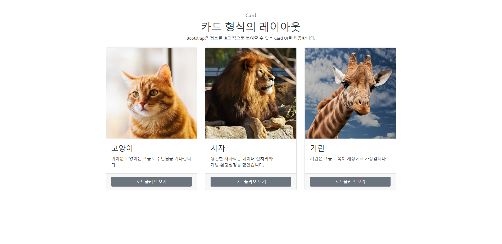
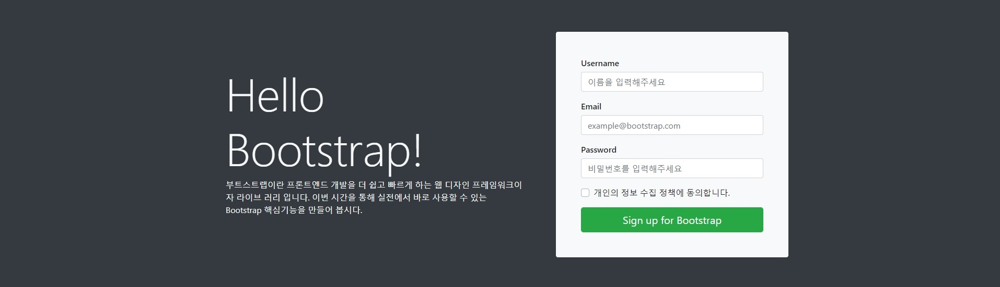
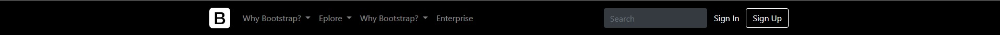

### Bootstrap이란?
> 세계에서 가장 인기있는 프론트 엔드 컴포넌트 라이브러리 
웹에서 반응 형의 모바일 우선 프로젝트를 구축 
부트 스트랩은 HTML, CSS 및 JS로 개발하기위한 오픈 소스 툴킷 
Sass 변수 및 믹스 인, 반응 형 그리드 시스템, 광범위한 사전 빌드 된 구성 요소 및 jQuery를 기반

### Bootstrap 공식 페이지
https://getbootstrap.com/

### Bootstrap 작동 화면
> #### Container
> 
> #### color
> 
> #### spacing
> 
> #### table
> 
> #### grid_system
> 
> #### card
> 
> #### carousel
> 
> #### jumbotron
> 
> #### navbar
> 
